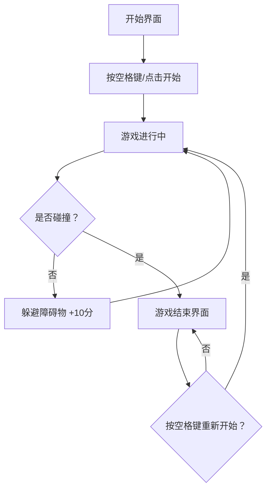

## 1. 产品概述

赛博霓虹骑士 - 一款在浏览器中运行的复古像素风格纵向摩托车赛车游戏。玩家操控赛博朋克风格摩托车在霓虹夜色中穿梭，躲避不断出现的障碍物，追求高分。

- **目标用户**：喜爱复古像素游戏和赛博朋克美学的休闲玩家
- **产品价值**：提供紧张刺激的街机式游戏体验，在浏览器中即可享受赛博朋克世界的速度与激情

## 2. 核心功能

### 2.1 功能模块

1. **游戏主界面**：Canvas 游戏画布、计分显示、操作提示
2. **玩家控制系统**：摩托车渲染、键盘左右移动、像素动画
3. **障碍物系统**：随机生成障碍箱/反向货车、自动下移、碰撞检测
4. **背景系统**：赛博朋克霓虹夜景、滚动道路、霓虹光效
5. **计分系统**：躲避障碍物加分、分数显示、最高分记录
6. **游戏状态管理**：开始界面、游戏中、游戏结束界面、重新开始

### 2.2 页面详情

| 页面名称 | 模块名称 | 功能描述 |
|-----------|-------------|---------------------|
| 开始界面 | 标题模块 | 展示游戏标题"赛博霓虹骑士"，霓虹发光效果 |
| 开始界面 | 开始按钮 | 点击或按空格键开始游戏 |
| 开始界面 | 操作说明 | 显示左右方向键控制移动的说明 |
| 游戏界面 | 游戏画布 | Canvas 渲染游戏场景，纵向滚动 |
| 游戏界面 | 计分器 | 右上角实时显示当前分数 |
| 游戏界面 | 玩家摩托 | 底部可控的像素摩托车 |
| 游戏界面 | 障碍物 | 从上往下移动的障碍箱和反向货车 |
| 结束界面 | 游戏结束 | 显示"GAME OVER"霓虹文字 |
| 结束界面 | 分数展示 | 显示最终得分和历史最高分 |
| 结束界面 | 重新开始 | 按空格键或点击按钮重新开始 |

## 3. 核心流程

玩家打开页面看到开始界面，按空格键开始游戏，摩托车出现在屏幕底部。玩家通过左右方向键控制摩托车横向移动，躲避从上方不断下落的障碍物（障碍箱、反向货车）。每成功躲过一个障碍物获得10分。当摩托车与障碍物发生碰撞时游戏结束，显示最终分数和最高分，玩家可按空格键重新开始。

## 4. 用户界面设计

### 4.1 设计风格

- **主色调**：深邃黑色 `#0a0a1a` 背景，搭配霓虹青 `#00ffff`、霓虹粉 `#ff00ff`、霓虹紫 `#9d00ff`、霓虹黄 `#ffff00`
- **像素风格**：所有元素采用像素艺术风格，线条硬朗，色彩鲜明
- **霓虹光效**：文字和图形带有发光效果（shadowBlur），营造赛博朋克氛围
- **字体**：使用像素风格等宽字体（如 Press Start 2P 或系统 monospace）

### 4.2 页面设计概述

| 页面名称 | 模块名称 | UI元素 |
|-----------|-------------|-------------|
| 开始界面 | 标题 | 大号像素字体，霓虹粉+青色渐变发光效果，居中显示 |
| 开始界面 | 开始提示 | 霓虹黄色闪烁文字"按空格键开始" |
| 游戏界面 | 背景 | 深色夜空，垂直滚动的霓虹道路线，两侧闪烁的霓虹建筑轮廓 |
| 游戏界面 | 玩家摩托 | 像素风格摩托车，主体霓虹青色，带霓虹粉尾灯，位于屏幕底部中央 |
| 游戏界面 | 障碍物 | 像素化障碍箱（霓虹紫色带警告条纹）、反向货车（霓虹红色带车灯） |
| 游戏界面 | 计分器 | 右上角霓虹青色数字显示"SCORE: 0000" |
| 结束界面 | GAME OVER | 大号霓虹红色发光文字，居中 |
| 结束界面 | 分数 | 霓虹黄色显示最终得分，霓虹青色显示最高分 |

### 4.3 响应式设计

- 桌面端为主，游戏画布固定尺寸 480x720 像素
- 支持移动端触摸滑动控制（左右滑动移动摩托车）
- 游戏画布居中显示在页面中央
