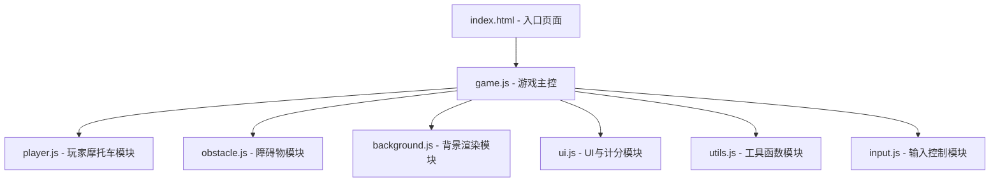

## 1. 架构设计



## 2. 技术说明

- **前端技术**：原生 HTML5 + Canvas 2D API + 原生 JavaScript（ES6 Modules）
- **构建方式**：无需构建工具，直接浏览器加载 ES Modules
- **项目类型**：纯前端静态项目，无后端依赖

## 3. 文件结构定义

| 文件路径 | 用途 |
|----------|------|
| `/index.html` | 游戏入口页面，包含 Canvas 元素和模块引入 |
| `/src/game.js` | 游戏主控制器，主循环、状态管理、碰撞检测 |
| `/src/player.js` | 玩家摩托车类，渲染、移动逻辑 |
| `/src/obstacle.js` | 障碍物类、障碍物管理器 |
| `/src/background.js` | 赛博朋克霓虹背景渲染 |
| `/src/ui.js` | 计分显示、开始/结束界面绘制 |
| `/src/input.js` | 键盘和触摸输入处理 |
| `/src/utils.js` | 通用工具函数（碰撞检测、随机数等） |
| `/src/constants.js` | 游戏常量配置（画布尺寸、颜色、速度等） |

## 4. 核心类设计

### 4.1 Game 类 (game.js)
- `constructor(canvas)` - 初始化游戏
- `init()` - 初始化游戏状态
- `start()` - 开始游戏循环
- `update(deltaTime)` - 更新所有游戏对象
- `render()` - 渲染所有游戏对象
- `gameOver()` - 处理游戏结束
- `checkCollisions()` - 碰撞检测

### 4.2 Player 类 (player.js)
- `constructor(x, y)` - 创建玩家摩托车
- `moveLeft()` / `moveRight()` - 移动控制
- `update()` - 更新位置（边界检测）
- `render(ctx)` - 像素风摩托车渲染

### 4.3 Obstacle 类 (obstacle.js)
- `constructor(x, y, type)` - 创建障碍物（box/truck）
- `update(speed)` - 向下移动
- `render(ctx)` - 渲染障碍物
- `getBounds()` - 获取碰撞矩形

### 4.4 ObstacleManager 类 (obstacle.js)
- `spawn()` - 随机生成新障碍物
- `update(speed)` - 更新所有障碍物
- `render(ctx)` - 渲染所有障碍物
- `checkPassed(playerY)` - 检测被躲过的障碍物并计分
- `getObstacles()` - 获取所有障碍物列表

### 4.5 Background 类 (background.js)
- `constructor(width, height)` - 初始化背景
- `update(speed)` - 更新滚动偏移
- `render(ctx)` - 渲染霓虹夜景、道路线、建筑

### 4.6 UI 类 (ui.js)
- `renderScore(ctx, score)` - 渲染当前分数
- `renderStartScreen(ctx)` - 渲染开始界面
- `renderGameOver(ctx, score, highScore)` - 渲染结束界面

### 4.7 InputHandler 类 (input.js)
- `constructor()` - 初始化输入监听
- `isLeftPressed()` / `isRightPressed()` - 查询按键状态
- `isSpacePressed()` - 查询空格键

## 5. 游戏常量 (constants.js)

```javascript
CANVAS_WIDTH = 480
CANVAS_HEIGHT = 720
PLAYER_WIDTH = 48
PLAYER_HEIGHT = 72
PLAYER_SPEED = 6
OBSTACLE_MIN_SPEED = 3
OBSTACLE_MAX_SPEED = 6
OBSTACLE_SPAWN_INTERVAL = 1200 (ms)
SCORE_PER_OBSTACLE = 10
COLORS = {
  BG: '#0a0a1a',
  NEON_CYAN: '#00ffff',
  NEON_PINK: '#ff00ff',
  NEON_PURPLE: '#9d00ff',
  NEON_YELLOW: '#ffff00',
  NEON_RED: '#ff3366',
  ROAD_LINE: '#1a1a3a'
}
```
